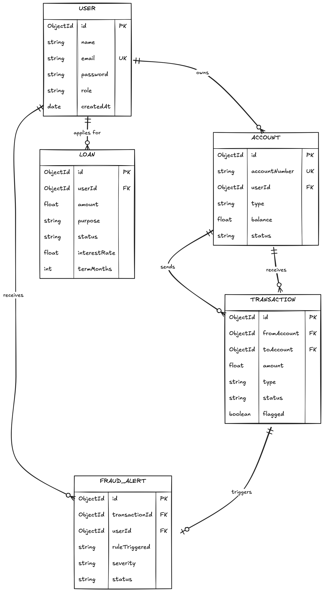

# 🗄️ Entity Relationship (ER) Diagram

The ER diagram defines our data persistence layer in MongoDB, focusing on the relationships between Users, Accounts, and Transactions.

### Data Entities:
- **User**: Core identity with authentication details.
- **Account**: Financial container (Savings/Checking).
- **Transaction**: Immutable record of money movement.
- **Loan**: Records of financial assistance applications.
- **FraudAlert**: Records generated by the Strategy engine.
