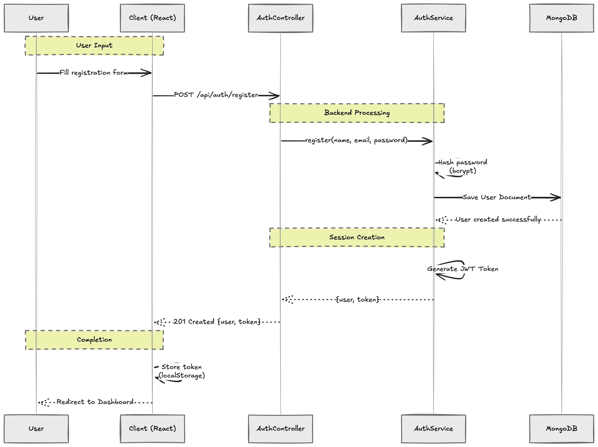
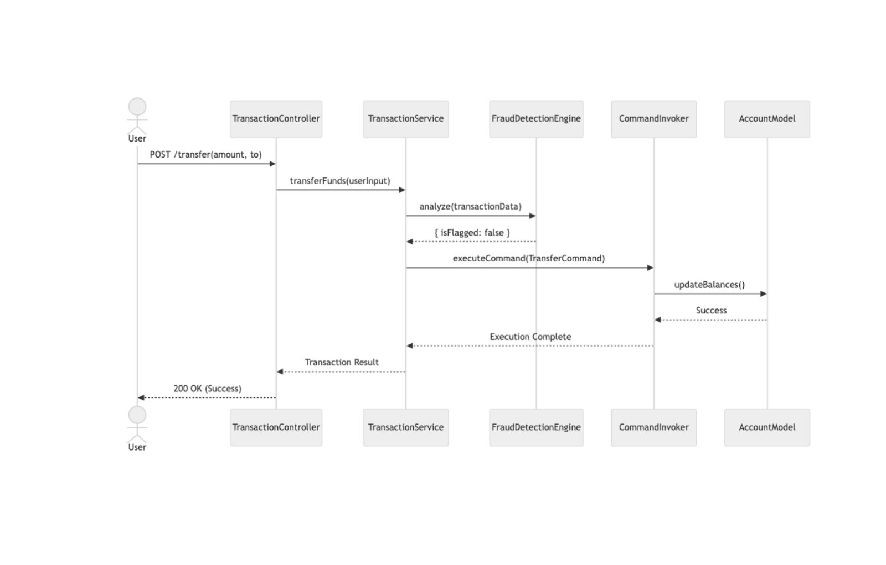
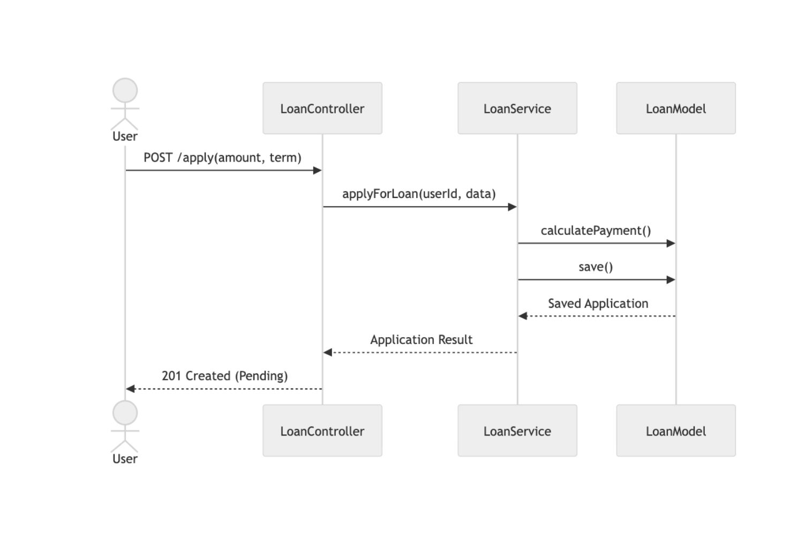

# 🔄 Sequence Diagrams

These diagrams illustrate the chronological flow of interactions between system components for key banking processes.

## 1. User Registration

## 2. Fund Transfer (with Fraud Check)

## 3. Loan Application

