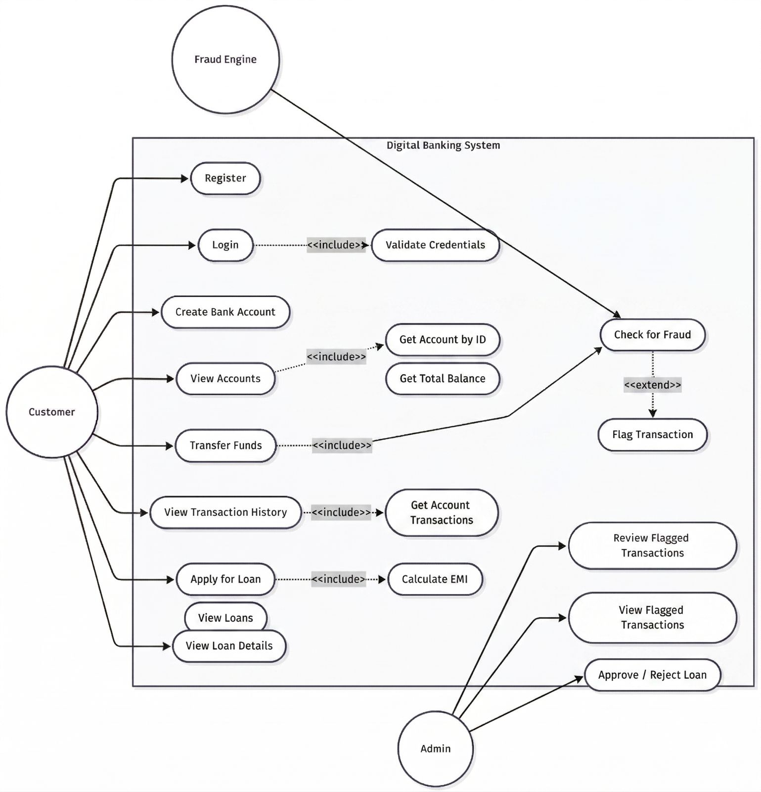

# 📋 Use Case Diagram

The use case diagram outlines the primary interactions between our system actors (Users and Admins) and the core banking functionalities.

### Key Use Cases:

#### For Customers:
- **Register/Login**: Secure access to their banking profiles.
- **Manage Accounts**: View balances and create Savings/Checking accounts.
- **Transfer Funds**: Move money between accounts (subject to fraud detection).
- **Apply for Loans**: Submit applications for Personal, Home, or Business loans.
- **View History**: Access detailed transaction logs.

#### For Admins:
- **Review Fraud Alerts**: Monitor transactions flagged by the Strategy engine.
- **Manage Loans**: Approve or reject loan applications.
- **System Monitoring**: Oversee platform health and integrity.
