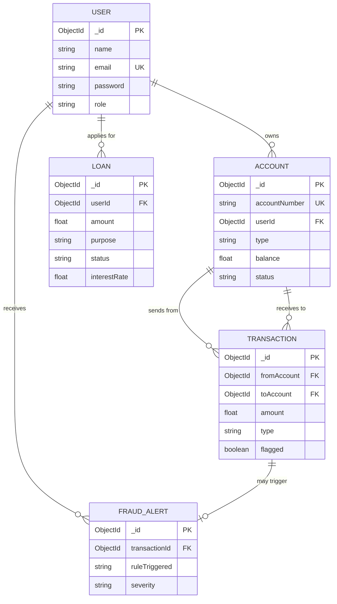

# 🛡️ PayShield — Digital Banking System with Fraud Detection

<div align="center">


**A full-stack digital banking application with real-time fraud detection**

---

### 🌐 Live Links
- **Frontend (Vercel):** [https://pay-shield-digital-banking-system.vercel.app](https://pay-shield-digital-banking-system.vercel.app)
- **Backend API (Render):** [https://payshield-digital-banking-system.onrender.com](https://payshield-digital-banking-system.onrender.com)

---

## 📋 Table of Contents

- [Overview](#overview)
- [Features](#features)
- [Tech Stack](#tech-stack)
- [System Architecture](#system-architecture)
- [Design Patterns](#design-patterns)
- [ER Diagram](#er-diagram)
- [OOP & SOLID Principles](#oop--solid-principles)
- [Folder Structure](#folder-structure)
- [Getting Started](#getting-started)
- [API Endpoints](#api-endpoints)
- [Fraud Detection Rules](#fraud-detection-rules)
- [Team Members](#team-members)

---

## Overview

PayShield is a full-stack digital banking application where users can create accounts, transfer funds, apply for loans, and view transaction statements. It features a **real-time fraud detection engine** that automatically flags suspicious transactions based on rule-based logic such as:

- 🚨 High-value transfers (> ₹50,000)
- ⚡ Rapid successive transactions (> 3 in 1 minute)
- 👤 Transfers to new/unknown recipients

Built using **React.js**, **Node.js**, **TypeScript**, **Express.js**, and **MongoDB** with **JWT authentication**, PayShield demonstrates core **System Design principles**, **OOP concepts**, **SOLID principles**, and **Design Patterns**.

---

## Features

| Feature | Description |
|---------|-------------|
| 🔐 **User Authentication** | Secure registration and login with JWT tokens and bcrypt password hashing |
| 🏦 **Account Management** | Create Savings and Checking accounts with unique account numbers |
| 💸 **Fund Transfers** | Transfer money between accounts with real-time balance updates |
| 📊 **Transaction History** | View complete transaction statements with filtering |
| 📋 **Loan Applications** | Apply for Personal, Home, Education, or Business loans with EMI calculation |
| 🛡️ **Fraud Detection** | Automatic flagging of suspicious transactions using rule-based engine |
| 🚨 **Fraud Alerts** | Admin dashboard for reviewing flagged transactions |

---

## Tech Stack

| Layer | Technology | Purpose |
|-------|-----------|---------|
| **Frontend** | React.js + Tailwind CSS | User interface & styling |
| **Backend** | Node.js + Express.js | REST API server |
| **Language** | TypeScript | Type safety across stack |
| **Database** | MongoDB + Mongoose | Data storage & ODM |
| **Authentication** | JWT + bcrypt | Secure auth & password hashing |
| **Build Tool** | Vite | Fast frontend development |

---

## System Architecture

```
┌──────────────────────────────────────────────┐
│              PRESENTATION LAYER              │
│         (React.js + Tailwind CSS)            │
│    Login │ Dashboard │ Transfers │ Loans     │
└──────────────────┬───────────────────────────┘
                   │ HTTP/REST (JSON)
┌──────────────────▼───────────────────────────┐
│             BUSINESS LOGIC LAYER             │
│          (Express.js + TypeScript)           │
│  Controllers → Services → Design Patterns   │
│  Auth │ Accounts │ Transactions │ Fraud      │
└──────────────────┬───────────────────────────┘
                   │ Mongoose ODM
┌──────────────────▼───────────────────────────┐
│               DATA ACCESS LAYER              │
│               (MongoDB Atlas)                │
│   Users │ Accounts │ Transactions │ Loans    │
└──────────────────────────────────────────────┘
```

For detailed diagrams, see:
- [Architecture Diagram](./diagrams/architecture-diagram.md)
- [Sequence Diagrams](./diagrams/sequence-diagrams.md)

---

## Design Patterns

PayShield implements **5 Gang of Four (GoF) design patterns**:

### 1. 🔒 Singleton Pattern (Creational)

**Used in:** `DatabaseConnection` — ensures a single MongoDB connection instance

```typescript
class DatabaseConnection {
  private static instance: DatabaseConnection;
  private constructor() {} // Private constructor

  static getInstance(): DatabaseConnection {
    if (!DatabaseConnection.instance) {
      DatabaseConnection.instance = new DatabaseConnection();
    }
    return DatabaseConnection.instance;
  }
}
```

**Why:** A banking application must maintain a single, consistent database connection to prevent pool exhaustion and ensure data consistency.

### 2. 🏭 Factory Pattern (Creational)

**Used in:** `AccountFactory` — creates Savings or Checking accounts with different configurations

```typescript
class AccountFactory {
  static createAccount(type: AccountType, userId: string): Account {
    switch (type) {
      case AccountType.SAVINGS:
        return new SavingsAccount(userId, interestRate: 0.04);
      case AccountType.CHECKING:
        return new CheckingAccount(userId, overdraftLimit: 5000);
    }
  }
}
```

### 3. 🎯 Strategy Pattern (Behavioral)

**Used in:** Fraud Detection — interchangeable fraud detection rules

```typescript
interface IFraudStrategy {
  analyze(transaction: ITransaction): Promise<FraudResult>;
}

// Multiple strategies implementing the same interface
class HighValueStrategy implements IFraudStrategy { ... }
class RapidTransactionStrategy implements IFraudStrategy { ... }
class NewRecipientStrategy implements IFraudStrategy { ... }
```

### 4. 👀 Observer Pattern (Behavioral)

**Used in:** Transaction events — observers are notified when fraud is detected

### 5. 📦 Command Pattern (Behavioral)

**Used in:** Banking transactions — encapsulated as command objects with `execute()` and `undo()`

📖 **Full documentation:** [Design Patterns Documentation](./docs/design-patterns.md)

---

## ER Diagram



**Cardinality:**
- **User → Account:** 1:N (one user can have many accounts)
- **User → Loan:** 1:N (one user can apply for many loans)
- **Account → Transaction:** 1:N (one account has many transactions)
- **Transaction → FraudAlert:** 1:0..1 (a transaction may trigger one fraud alert)

📖 **Full ER diagram:** [ER Diagram Documentation](./diagrams/er-diagram.md)

---

## OOP & SOLID Principles

### OOP Concepts Used

| Concept | Where Applied |
|---------|---------------|
| **Encapsulation** | Password hashing hidden inside User model; balance only modified via service methods |
| **Abstraction** | Service layer hides database queries from controllers |
| **Inheritance** | SavingsAccount and CheckingAccount extend base Account |
| **Polymorphism** | Multiple fraud strategies implement IFraudStrategy interface |

### SOLID Principles

| Principle | Application |
|-----------|-------------|
| **S** — Single Responsibility | Each service handles one domain (Auth, Account, Transaction, Loan) |
| **O** — Open/Closed | Fraud engine extensible via new strategies without modification |
| **L** — Liskov Substitution | Account subtypes are interchangeable |
| **I** — Interface Segregation | Small, focused interfaces (IUser, IAccount, ITransaction) |
| **D** — Dependency Inversion | Controllers depend on service abstractions |

📖 **Full documentation:** [OOP Concepts](./docs/oop-concepts.md) | [SOLID Principles](./docs/solid-principles.md)

---

## Folder Structure

```
PayShield-Digital-Banking-System/
├── README.md
├── .gitignore
├── docs/                              # Documentation
│   ├── system-design.md
│   ├── oop-concepts.md
│   ├── solid-principles.md
│   ├── design-patterns.md
│   └── sdlc.md
├── diagrams/                          # Architecture & ER diagrams
│   ├── er-diagram.md
│   ├── class-diagram.md
│   ├── architecture-diagram.md
│   └── sequence-diagrams.md
├── db/                                # Database scripts
│   ├── seed.ts
│   └── indexes.ts
└── src/
    └── server/                        # Backend (Express + TypeScript)
        ├── package.json
        ├── tsconfig.json
        ├── server.ts                  # Entry point
        ├── config/
        │   └── database.ts            # Singleton DB connection
        ├── interfaces/                # TypeScript interfaces
        │   ├── IUser.ts
        │   ├── IAccount.ts
        │   ├── ITransaction.ts
        │   ├── ILoan.ts
        │   └── IFraudRule.ts
        ├── models/                    # Mongoose models
        │   ├── User.ts
        │   ├── Account.ts
        │   ├── Transaction.ts
        │   └── Loan.ts
        ├── services/                  # Business logic
        │   ├── AuthService.ts
        │   ├── AccountService.ts
        │   ├── TransactionService.ts
        │   └── LoanService.ts
        ├── controllers/               # HTTP handlers
        │   ├── AuthController.ts
        │   ├── AccountController.ts
        │   ├── TransactionController.ts
        │   └── LoanController.ts
        ├── routes/                    # API routes
        │   ├── authRoutes.ts
        │   ├── accountRoutes.ts
        │   ├── transactionRoutes.ts
        │   └── loanRoutes.ts
        ├── middleware/
        │   ├── auth.ts                # JWT middleware
        │   └── errorHandler.ts
        ├── patterns/                  # Design Patterns
        │   ├── singleton/DatabaseConnection.ts
        │   ├── factory/AccountFactory.ts
        │   ├── observer/EventEmitter.ts
        │   ├── observer/FraudAlertObserver.ts
        │   ├── strategy/HighValueStrategy.ts
        │   ├── strategy/RapidTransactionStrategy.ts
        │   ├── strategy/NewRecipientStrategy.ts
        │   ├── command/ICommand.ts
        │   ├── command/TransferCommand.ts
        │   ├── command/DepositCommand.ts
        │   └── command/CommandInvoker.ts
        └── fraud/
            └── FraudDetectionEngine.ts
```

---

## Getting Started

### Prerequisites

- Node.js (v18+)
- MongoDB (local or Atlas)
- npm or yarn

### Installation

```bash
# Clone the repository
git clone https://github.com/Dhanvin1520/PayShield-Digital-Banking-System.git
cd PayShield-Digital-Banking-System

# Install backend dependencies
cd src/server
npm install

# Create environment file
cp .env.example .env
# Edit .env with your MongoDB URI and JWT secret

# Start the development server
npm run dev
```

### Environment Variables

```env
PORT=5000
MONGO_URI=mongodb://localhost:27017/payshield
JWT_SECRET=your_jwt_secret_key
JWT_EXPIRES_IN=7d
```

---

## API Endpoints

| Method | Endpoint | Description | Auth |
|--------|----------|-------------|------|
| POST | `/api/auth/register` | Register new user | ❌ |
| POST | `/api/auth/login` | Login and get JWT | ❌ |
| GET | `/api/auth/me` | Get current user profile | ✅ |
| POST | `/api/accounts` | Create new account | ✅ |
| GET | `/api/accounts` | Get user's accounts | ✅ |
| GET | `/api/accounts/:id` | Get account by ID | ✅ |
| POST | `/api/transactions/transfer` | Transfer funds | ✅ |
| GET | `/api/transactions` | Transaction history | ✅ |
| GET | `/api/transactions/flagged` | Flagged transactions | 🔑 Admin |
| POST | `/api/loans/apply` | Apply for loan | ✅ |
| GET | `/api/loans` | View loan applications | ✅ |
| PATCH | `/api/loans/:id/status` | Update loan status | 🔑 Admin |

---

## Fraud Detection Rules

| Rule | Trigger | Severity |
|------|---------|----------|
| **High Value Transfer** | Single transaction > ₹50,000 | Medium/High |
| **Rapid Transactions** | More than 3 transactions in 1 minute | High |
| **New Recipient** | First-time transfer to unknown account | Low |

The fraud detection engine uses the **Strategy Pattern**, allowing new rules to be added without modifying existing code (Open/Closed Principle).

---

## SDLC Methodology

PayShield follows the **Agile** methodology with iterative sprints:

| Phase | Status |
|-------|--------|
| Planning & Requirements | ✅ Complete |
| Design (Architecture, ER, Class Diagrams) | ✅ Complete |
| Sprint 1 — Core Backend (40%) | ✅ Complete|
| Sprint 2 — Frontend & Integration | ✅ Complete|
| Sprint 3 — Testing & Deployment | ✅ Complete |

📖 **Full SDLC documentation:** [SDLC Document](./docs/sdlc.md)

---


## 👥 Team Members

| Name | ID | Role |
|:---|:---|:---|
| **Dhanvin Vadlamudi** | 2401010150 | Team Lead (Auth, Core Setup, Singleton) |
| **Nipun Patlori** | 2401010323 | Backend (Accounts, Transactions, Factory, Command) |
| **Tejaswini Palwai** | 2401010314 | Backend (Fraud Engine, Strategy, Observer) |
| **Meka Chaitanya Sai** | 2401010275 | Structure (Routing, Middleware, Layout) |
| **Killi Akshith Kumar** | 2401010230 | Documentation (Diagrams, Database, README) |

---

<div align="center">
  <strong>🛡️ PayShield — Secure. Smart. Reliable.</strong>
</div>

