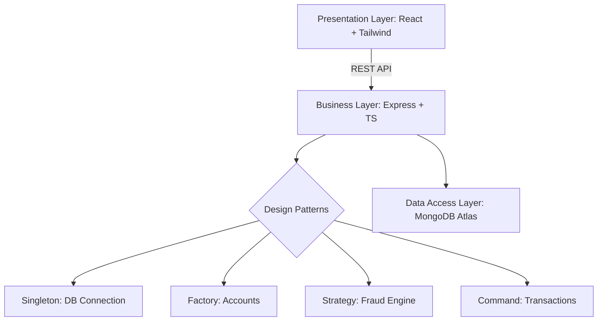

# 🛡️ PayShield: Advanced Digital Banking & Fraud Detection

<div align="center">


**Secure. Smart. Scalable.** — A production-ready banking ecosystem built with architectural excellence.

---

### 🌐 Live Deployment
[**🚀 Launch App (Frontend)**](https://pay-shield-digital-banking-system.vercel.app) | [**📡 API Status (Backend)**](https://payshield-digital-banking-system.onrender.com)

</div>

---

## 📖 Overview

PayShield is a comprehensive digital banking platform that moves beyond simple balance management. It integrates a **real-time, strategy-based fraud detection engine** that monitors every transaction for suspicious behavior, mirroring the security infrastructure of modern financial institutions.

### ✨ Key Features
- **🏦 Unified Banking**: Create Savings/Checking accounts with automated interest and overdraft logic.
- **🛡️ Smart Security**: Rule-based fraud detection (High-value, Rapid-fire, and New Recipient checks).
- **📊 Admin Oversight**: Dedicated dashboard for loan processing and fraud investigation.
- **💸 Command-Driven Transfers**: Transaction integrity ensured through the Command Pattern.
- **📈 Real-time Analytics**: Instant balance updates and interactive transaction history.

---

## 🛠️ Technical Excellence

PayShield is built as a showcase of **System Design** and **Software Engineering best practices**.

### 🎨 Design Patterns (Gang of Four)
| Pattern | Implementation | Purpose |
|:---|:---|:---|
| **Singleton** | `DatabaseConnection` | Manages a single, efficient MongoDB connection pool. |
| **Factory** | `AccountFactory` | Generates specialized account types (Savings/Checking) with custom rules. |
| **Strategy** | `FraudDetectionEngine` | Swappable detection rules (HighValue, RapidTxn, NewRecipient). |
| **Observer** | `TransactionEventEmitter` | Decouples fraud analysis from alert logging and notifications. |
| **Command** | `TransferCommand` | Encapsulates money movement as reversible objects for audit integrity. |

<details>
<summary><b>🔍 View OOP & SOLID Implementation</b></summary>

#### OOP Concepts
- **Encapsulation**: Strict service-layer boundaries and private data handling.
- **Abstraction**: Interface-driven design for fraud rules and banking services.
- **Inheritance**: Specialized account models extending a core banking template.
- **Polymorphism**: Uniform execution of diverse fraud strategies.

#### SOLID Principles
- **S**: Each service (Auth, Loan, Account) has a single, well-defined responsibility.
- **O**: Fraud engine is open for new rules but closed for core logic modification.
- **L**: Account subtypes are perfectly interchangeable in transaction logic.
- **I**: Focused, lean interfaces (IUser, IAccount, ITransaction).
- **D**: High-level controllers depend on service abstractions, not low-level models.
</details>

---

## 🏗️ System Architecture



---

## 📂 Project Structure

```text
PayShield/
├── src/
│   ├── server/               # Node.js + Express (TypeScript)
│   │   ├── patterns/         # 🔒 Singleton, 🏭 Factory, 📦 Command, 👀 Observer
│   │   ├── fraud/            # 🎯 Strategy-based Detection Engine
│   │   ├── services/         # Core Business Logic
│   │   └── models/           # Mongoose Data Schemas
│   └── client/               # React (Vite) + Vanilla CSS
├── diagrams/                 # Architecture, ER, and Sequence UMLs
└── docs/                     # Technical Documentation & SDLC
```

---

## 🚀 Getting Started

### 📋 Prerequisites
- Node.js v18+
- MongoDB Atlas account (or local MongoDB)

### ⚙️ Installation

1. **Clone & Install**
   ```bash
   git clone https://github.com/Dhanvin1520/PayShield-Digital-Banking-System.git
   cd PayShield-Digital-Banking-System
   npm install && cd src/server && npm install
   ```

2. **Environment Setup**
   Create a `.env` in `src/server/`:
   ```env
   PORT=5001
   MONGO_URI=your_mongodb_uri
   JWT_SECRET=your_secret
   ```

3. **Launch**
   ```bash
   npm run dev  # Starts both frontend and backend
   ```

---

## 🔑 Demo Access

| Role | Email | Password |
|:---|:---|:---|
| **Administrator** | `dhanvin@payshield.com` | `password123` |
| **Standard User** | `dhanvin@gmail.com` | `password123` |

---

## 👥 The Team

| Member | Role | Focus |
|:---|:---|:---|
| **Dhanvin Vadlamudi** | Team Lead | Auth & Core Architecture |
| **Nipun Patlori** | Backend Developer | Banking Services & Patterns |
| **Tejaswini Palwai** | Security Engineer | Fraud Engine & Strategy Logic |
| **Meka Chaitanya Sai** | Fullstack Engineer | UI/UX & Routing Infrastructure |
| **Killi Akshith Kumar** | System Architect | Diagrams & Documentation |

---

<div align="center">

**Developed for the SDSE Capstone Project @ Rishihood University**  
🛡️ *Secure. Smart. Reliable.*

</div>
