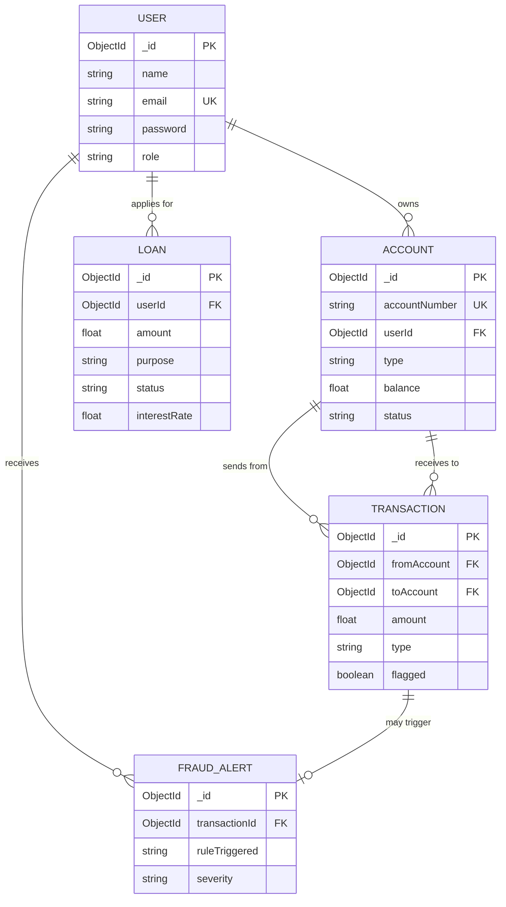

# 🛡️ PayShield — Digital Banking System with Fraud Detection

<div align="center">


A full-stack digital banking application with real-time fraud detection

---

### 🌐 Live Links
- Frontend (Vercel): [https://pay-shield-digital-banking-system.vercel.app](https://pay-shield-digital-banking-system.vercel.app)
- Backend API (Render): [https://payshield-digital-banking-system.onrender.com](https://payshield-digital-banking-system.onrender.com)

---

### 📄 Project Reports
- Final Project Report (PDF): [Download Report](./docs/Final_Report.pdf)
- Technical Report (LaTeX): [View LaTeX](./docs/Final_Report.tex)
- Technical Report (Markdown): [View Markdown](./docs/Final_Report.md)
- System Design Document (PDF): [View SD](./docs/sd.pdf)

---

</div>

---

## 📋 Table of Contents

- [Overview](#overview)
- [Features](#features)
- [Tech Stack](#tech-stack)
- [System Architecture](#system-architecture)
- [Design Patterns](#design-patterns)
- [ER Diagram](#er-diagram)
- [OOP & SOLID Principles](#oop--solid-principles)
- [Folder Structure](#folder-structure)
- [Getting Started](#getting-started)
- [Testing](#testing)
- [API Endpoints](#api-endpoints)
- [Fraud Detection Rules](#fraud-detection-rules)
- [Team Members](#team-members)

---

## Overview

PayShield is a full-stack digital banking application where users can create accounts, transfer funds, apply for loans, and view transaction statements. It features a real-time fraud detection engine that automatically flags suspicious transactions based on rule-based logic such as:

- 🚨 High-value transfers (> ₹50,000)
- ⚡ Rapid successive transactions (> 3 in 1 minute)
- 👤 Transfers to new/unknown recipients

Built using React.js, Node.js, TypeScript, Express.js, and MongoDB with JWT authentication, PayShield demonstrates core System Design principles, OOP concepts, SOLID principles, and Design Patterns.

---

## Features

| Feature | Description |
|:---|:---|
| 🔐 User Authentication | Secure registration and login with JWT tokens and bcrypt password hashing |
| 🏦 Account Management | Create Savings and Checking accounts with unique account numbers |
| 💸 Fund Transfers | Transfer money between accounts with real-time balance updates |
| 📊 Transaction History | View complete transaction statements with filtering |
| 📋 Loan Applications | Apply for Personal, Home, Education, or Business loans with EMI calculation |
| 🛡️ Fraud Detection | Automatic flagging of suspicious transactions using rule-based engine |
| 🚨 Fraud Alerts | Admin dashboard for reviewing flagged transactions |

---

## Tech Stack

| Layer | Technology | Purpose |
|:---|:---|:---|
| Frontend | React.js + Tailwind CSS | User interface & styling |
| Backend | Node.js + Express.js | REST API server |
| Language | TypeScript | Type safety across stack |
| Database | MongoDB + Mongoose | Data storage & ODM |
| Authentication | JWT + bcrypt | Secure auth & password hashing |
| Build Tool | Vite | Fast frontend development |

---

## System Architecture

```text
┌──────────────────────────────────────────────┐
│              PRESENTATION LAYER              │
│         (React.js + Tailwind CSS)            │
│    Login │ Dashboard │ Transfers │ Loans     │
└──────────────────┬───────────────────────────┘
                   │ HTTP/REST (JSON)
┌──────────────────▼───────────────────────────┐
│             BUSINESS LOGIC LAYER             │
│          (Express.js + TypeScript)           │
│  Controllers → Services → Design Patterns   │
│  Auth │ Accounts │ Transactions │ Fraud      │
└──────────────────┬───────────────────────────┘
                   │ Mongoose ODM
┌──────────────────▼───────────────────────────┐
│               DATA ACCESS LAYER              │
│               (MongoDB Atlas)                │
│   Users │ Accounts │ Transactions │ Loans    │
└──────────────────────────────────────────────┘
```

For detailed diagrams, see:
- [Architecture Diagram](./diagrams/architecture-diagram.md)
- [Sequence Diagrams](./diagrams/sequence-diagrams.md)

---

## Design Patterns

PayShield implements 5 Gang of Four (GoF) design patterns:

### 1. 🔒 Singleton Pattern (Creational)
Used in: `DatabaseConnection` — ensures a single MongoDB connection instance.

### 2. 🏭 Factory Pattern (Creational)
Used in: `AccountFactory` — creates Savings or Checking accounts with different configurations.

### 3. 🎯 Strategy Pattern (Behavioral)
Used in: Fraud Detection — interchangeable fraud detection rules.

### 4. 👀 Observer Pattern (Behavioral)
Used in: Transaction events — observers are notified when fraud is detected.

### 5. 📦 Command Pattern (Behavioral)
Used in: Banking transactions — encapsulated as command objects with `execute()` and `undo()`.

📖 Full documentation: [Design Patterns Documentation](./docs/design-patterns.md)

---

## ER Diagram



📖 Full ER diagram: [ER Diagram Documentation](./diagrams/er-diagram.md)

---

## OOP & SOLID Principles

### OOP Concepts Used
| Concept | Where Applied |
|:---|:---|
| Encapsulation | Password hashing hidden inside User model; balance only modified via service methods |
| Abstraction | Service layer hides database queries from controllers |
| Inheritance | SavingsAccount and CheckingAccount extend base Account |
| Polymorphism | Multiple fraud strategies implement IFraudStrategy interface |

### SOLID Principles
| Principle | Application |
|:---|:---|
| S — Single Responsibility | Each service handles one domain (Auth, Account, Transaction, Loan) |
| O — Open/Closed | Fraud engine extensible via new strategies without modification |
| L — Liskov Substitution | Account subtypes are interchangeable |
| I — Interface Segregation | Small, focused interfaces (IUser, IAccount, ITransaction) |
| D — Dependency Inversion | Controllers depend on service abstractions |

📖 Full documentation: [OOP Concepts](./docs/oop-concepts.md) | [SOLID Principles](./docs/solid-principles.md)

---

## Folder Structure

```text
PayShield-Digital-Banking-System/
├── docs/                              # Documentation
├── diagrams/                          # Architecture & ER diagrams
├── db/                                # Database scripts
└── src/
    └── server/                        # Backend (Express + TypeScript)
        ├── config/                    # Singleton DB connection
        ├── interfaces/                # TypeScript interfaces
        ├── models/                    # Mongoose models
        ├── services/                  # Business logic
        ├── controllers/               # HTTP handlers
        ├── routes/                    # API routes
        ├── middleware/                # JWT middleware
        ├── patterns/                  # Design Patterns (Creational & Behavioral)
        └── fraud/                     # Fraud Detection Engine
```

---

## Getting Started

### Prerequisites
- Node.js (v18+)
- MongoDB (local or Atlas)

### Installation
```bash
# Clone the repository
git clone https://github.com/Dhanvin1520/PayShield-Digital-Banking-System.git
cd PayShield-Digital-Banking-System

# Install backend dependencies
cd src/server
npm install

# Start the development server
npm run dev
```

---

## Testing

PayShield includes comprehensive test coverage for both the frontend and backend. Tests are automatically run via GitHub Actions on push and pull requests to ensure code quality.

### Running Tests Locally

**Backend Unit Tests**
```bash
cd src/server
npm run test
```

**Frontend Unit Tests**
```bash
cd src/client
npm run test
```

**Frontend Integration Tests**
```bash
cd src/client
npm run test:integration
```

---

## API Endpoints

| Method | Endpoint | Description | Auth |
|:---|:---|:---|:---|
| POST | `/api/auth/register` | Register new user | ❌ |
| POST | `/api/auth/login` | Login and get JWT | ❌ |
| GET | `/api/auth/me` | Get current user profile | ✅ |
| POST | `/api/accounts` | Create new account | ✅ |
| GET | `/api/accounts` | Get user's accounts | ✅ |
| POST | `/api/transactions/transfer` | Transfer funds | ✅ |
| GET | `/api/transactions/flagged` | Flagged transactions | 🔑 Admin |
| PATCH | `/api/loans/:id/status` | Update loan status | 🔑 Admin |

---

## 👥 Team Members

| Name | ID | Role |
|:---|:---|:---|
| Dhanvin Vadlamudi | 2401010150 | Team Lead (Auth, Core Setup, Singleton) |
| Nipun Patlori | 2401010323 | Backend (Accounts, Transactions, Factory, Command) |
| Tejaswini Palwai | 2401010314 | Backend (Fraud Engine, Strategy, Observer) |
| Meka Chaitanya Sai | 2401010275 | Structure (Routing, Middleware, Layout) |
| Killi Akshith Kumar | 2401010230 | Documentation (Diagrams, Database, README) |

---

<div align="center">
  <strong>🛡️ PayShield — Secure. Smart. Reliable.</strong>
</div>
