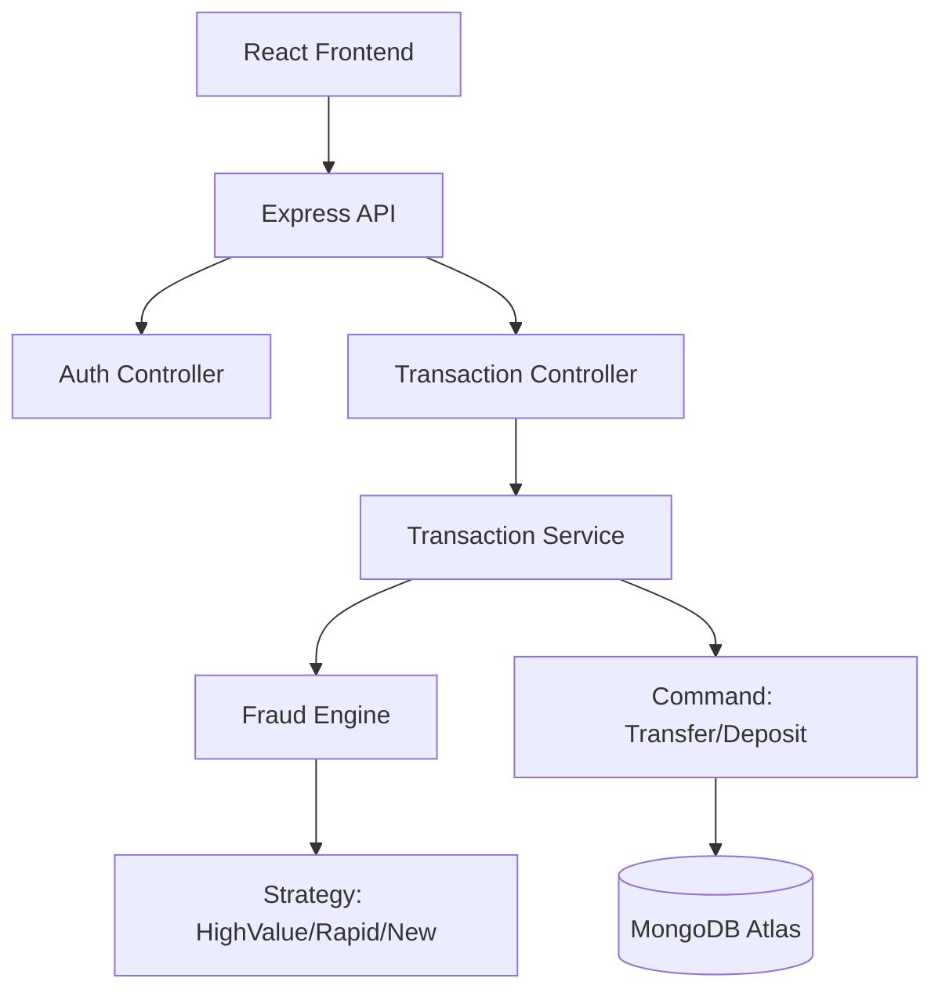

# 🏛️ System Design & Architecture

PayShield is designed to be a scalable, high-performance banking application. The architecture is built to ensure low latency for transactions and high reliability for financial data.

## 1. High-Level Architecture
The system follows a **3-Tier Architecture**:
1. **Presentation Tier (React.js)**: A dynamic SPA (Single Page Application) that communicates with the backend via RESTful APIs.
2. **Logic Tier (Node.js + Express)**: The "brain" of the system where all validation, business rules, and design patterns live.
3. **Data Tier (MongoDB)**: A NoSQL database chosen for its flexibility in handling various transaction types and account metadata.

## 2. API Design
We use JSON as the standard data exchange format. All endpoints are protected by **JWT (JSON Web Token)** authentication, ensuring that users can only access their own financial data.

## 3. Security Architecture
- **Password Hashing**: Bcrypt with 10 salt rounds.
- **Data sanitization**: Middleware used to prevent NoSQL injection.
- **Pattern-based Protection**: The Fraud Engine acts as a gatekeeper for the transaction layer.

## 4. Component Relationships

